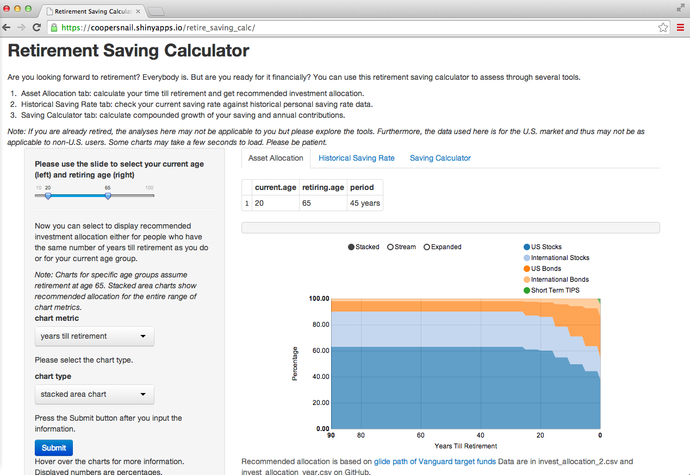

--- 
title       : Retirement Saving Calculator - A Shiny App
subtitle    : Coursera - Developing Data Products Project
author      : CS
job         : Aspiring data scientist
logo        : piggy_bank.png
framework   : io2012        # {io2012, html5slides, shower, dzslides, ...}
highlighter : highlight.js  # {highlight.js, prettify, highlight}
hitheme     : tomorrow      # 
widgets     : [shiny]     # {mathjax, quiz, bootstrap}
ext_widgets : {rCharts: [libraries/nvd3]}
mode        : selfcontained # {standalone, draft}
knit        : slidify::knit2slides

--- 

## What is the Retirement Saving Calculator?

- The [Retirement Saving Calculator](https://coopersnail.shinyapps.io/retire_saving_calc/) is an interactive Shiny app that helps you assess your financial readiness for retirement.

 

    

      

--- 

## What can the Retirement Saving Calculator do?

- There are three tools in the Retirement Saving Calculator:

1. **Asset Allocation**: calculates your time till retirement and gives recommended investment allocation.
2. **Historical Saving Rate**: checks your current saving rate against historical personal saving rate data.
3. **Saving Calculator**: calculates and visualizes compounded growth of your saving and annual contributions.

--- 

## Here's a taste of the Retirement Saving Calculator

- Below is one of the charts available in the app. You can hover over it to find the recommended investment allocation for your age group. 
<iframe src=' assets/fig/unnamed-chunk-1.html ' scrolling='no' frameBorder='0' seamless class='rChart nvd3 ' id=iframe- chart1126a106a171 ></iframe> 

*See index.Rmd for code, `echo=FALSE` here.* 

---

## There is much more for you to explore!

## Remember, it's not how much you make, it's how much you save!

- Acknowledgement: 

Data and formula are sourced from <a href="http://research.stlouisfed.org/fred2/series/PSAVERT/">the Federal Reserve Bank of St. Louis</a>, <a href="http://www.wealthadvisors.com/assets/vanguard%20allocation%20updatetrf%20changes.pdf">wealthadvisors.com and Vanguard funds</a>, and <a href="http://www.moneychimp.com/articles/finworks/fmbasinv.htm">moneychimp.com</a>

Icons made by <a href="http://www.freepik.com" alt="Freepik.com" title="Freepik.com">Freepik</a> from <a href="http://www.flaticon.com/free-icon/up-arrow-of-money-incomes-and-business-man_46632" title="Flaticon">www.flaticon.com</a>

--- &custft 

